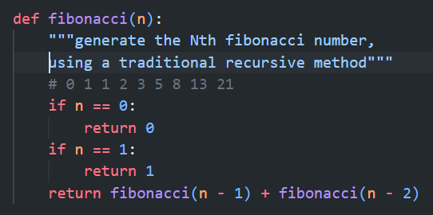
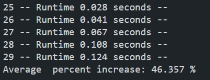
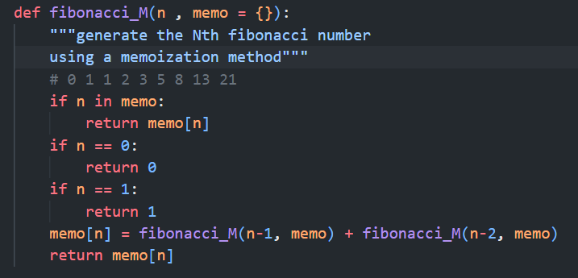
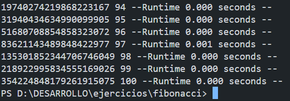

# Secuencia de Fibonacci
##Ejercicio de programacion dinámica
## By: Juan Diego Cubillos - Especialista en ingeniería de software
### [Github](https://github.com/juandinetUPC)
### [LinkedIn](https://linkedin.com/in/juan-diego-cubillos-630654195)

Tradicionalmente se ha enseñado a calcular la secuencia de fibonacci, usando recursividad pero este método resulta ser altamente ineficiente
debido a que recalcula numeros que ya ha calculado con anterioridad.

A pequeña escala (primeros 35 numeros) la eficiencia es aceptable, pero a medida que aumenta el numero de numeros calculados, la eficiencia disminuye a razón de mas de un 30% de tiempo por cada iteración lo que hace inviable por lo menos, calcular series grandes como de 100 o 500.

Para resolver este problema, se utilizó una estrategia de memorizacion, que consiste en guardar los numeros calculados en una tabla hash, y asi evitar que se recalcule un numero que ya ha sido calculado.

